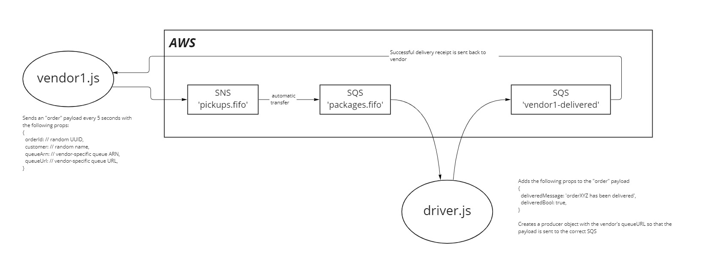

# CAPS (AWS Refactor)

An AWS-powered parcel delivery service that allows for vendors, such as flower shops or restaurants, to alert a system of a package needing to be delivered, for drivers to instantly see what’s in their pickup queue, and then to alert the vendors as to the state of the deliveries.

## UML Diagram

